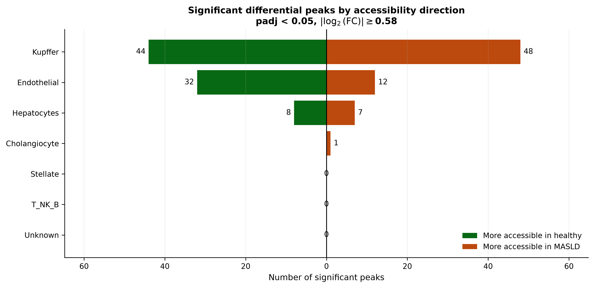
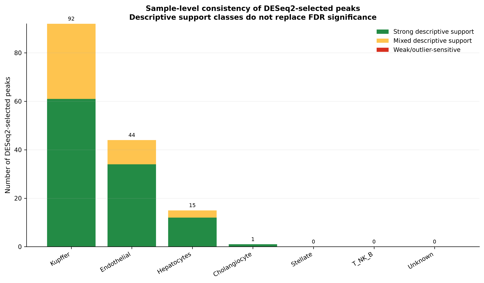

# 🧬 Hide and Peak

**Hide and Peak** is a computational genomics project that searches for cell-type-specific chromatin accessibility changes associated with MASLD that are not captured by known liver eQTL variants, and links those regulatory regions to candidate target genes using Activity-by-Contact (ABC) predictions.

> Which MASLD-associated regulatory signals are hiding outside known liver eQTLs – and which genes might they control?

This project was developed by [Or Forshmit](https://github.com/OrF8), [Dvir Mateless](https://github.com/Dvirmat), and [Noam Kimhi](https://github.com/noam-kimhi) for **76553 – Computational Genomics** at the **Hebrew University of Jerusalem**, as part of the course's liver-genomics hackathon.

<p align="center">
  
  
  
  
  
  
  
  
</p>

---

## 📚 Table of Contents

- [Overview](#-overview)
- [Research Question](#-research-question)
- [Dataset](#-dataset)
- [Methodology](#-methodology)
- [Project Structure](#-project-structure)
- [Getting Started](#-getting-started)
- [Usage](#-usage)
- [Results](#-results)
- [Interpretation and Limitations](#-interpretation-and-limitations)
- [Technologies](#-technologies)
- [Contributors](#-contributors)
- [Course Context](#-course-context)
- [References](#-references)
- [License](#-license)

---

## 🔎 Overview

Metabolic dysfunction-associated steatotic liver disease, or **MASLD**, can involve regulatory changes that appear only in particular liver cell types. A signal that is clear in Kupffer cells, hepatocytes, or endothelial cells may be diluted or missed when measured in bulk liver tissue.

This repository performs a focused follow-up analysis using single-nucleus ATAC-seq data from Zhu et al. 2026. snATAC-seq measures chromatin accessibility in individual nuclei. In this project, an accessible region is represented as a **peak**: a genomic interval where chromatin is open enough to be detected by ATAC-seq.

The pipeline builds shared peak coordinates across samples, aggregates accessibility counts into per-sample pseudobulk matrices for each cell type, and tests healthy versus MASLD accessibility with PyDESeq2. It then focuses on high-confidence significant peaks that do **not** overlap significant GTEx v8 liver eQTL variants.

An **eQTL record** is a variant–gene association. The eQTL filtering step removes peaks that overlap known significant GTEx liver eQTL variant positions. This does not prove that the remaining regions have no regulatory effects. Instead, it asks whether differential accessibility can nominate additional candidate regulatory regions beyond those already marked by a liver eQTL catalogue.

Remaining peaks are connected to candidate target genes using Activity-by-Contact predictions. ABC provides predicted enhancer–gene links, not experimental proof that a peak regulates a gene.

The motivating study is:

> Biying Zhu et al., "Integrative analyses elucidate transcriptional regulatory functions of risk alleles for metabolic liver disease," *Nature Genetics*, 2026. DOI: [10.1038/s41588-026-02617-8](https://doi.org/10.1038/s41588-026-02617-8)

This repository does **not** reproduce the full paper. It implements a focused, course-project analysis using the study's single-nucleus ATAC-seq data.

---

## ❓ Research Question

**Can cell-type-specific chromatin accessibility peaks that differ between healthy and MASLD liver, but do not overlap significant liver eQTL variants, reveal plausible regulatory genes that an eQTL-overlap analysis would miss?**

Focused subquestions:

- Which liver cell types contain high-confidence differential accessibility peaks?
- Are these peaks more accessible in healthy or MASLD samples?
- Which candidate genes are linked to the non-eQTL-overlapping peaks by ABC?
- Are the linked genes biologically plausible in MASLD or MASH biology?

---

## 🧫 Dataset

Only datasets used by the current repository are listed here.

| Dataset or resource                               | Role in this project                                                                      | Genome build                                          | Included in repo?                                                                | Expected path                                                 |
|---------------------------------------------------|-------------------------------------------------------------------------------------------|-------------------------------------------------------|----------------------------------------------------------------------------------|---------------------------------------------------------------|
| GSE281367 snATAC-seq matrices                     | Raw peak-by-cell accessibility matrices, barcode files, and peak BED files for 12 samples | GRCh38/hg38 peak coordinates in this pipeline         | Sample directories are present; the large Seurat RDS is excluded by `.gitignore` | `data/snatac_gse281367/`                                      |
| GSE281367 clustered Seurat object                 | Source of cell-type annotations used to map barcodes to cell types                        | Not used as genomic intervals                         | Not tracked; `.gitignore` points to GEO download                                 | `data/snatac_gse281367/GSE281367_seurat_clustered.rds.gz`     |
| GTEx v8 significant liver eQTL variant–gene pairs | Defines significant liver eQTL variant positions removed from significant peaks           | GRCh38, parsed from `variant_id` ending in `b38`      | Present as compressed table                                                      | `data/eqtl_gtex_v8/Liver.v8.signif_variant_gene_pairs.txt.gz` |
| ENCODE blacklist                                  | Removes problematic genomic intervals during consensus peak construction                  | GRCh38                                                | Present                                                                          | `data/reference_grch38/ENCFF356LFX.bed.gz`                    |
| Engreitz Lab ABC predictions                      | Maps filtered peaks to candidate target genes                                             | Original file hg19; lifted to hg38 in this repository | Original, lifted, and liver dictionary files are present                         | `data/ABC/`                                                   |
| UCSC liftOver chain and executable                | Converts ABC enhancer intervals from hg19 to hg38                                         | hg19 to hg38                                          | Present                                                                          | `data/ABC/hg19ToHg38.over.chain.gz`, `data/ABC/liftOver`      |

The source study contains six normal and six MASH/MASLD liver samples. The repository contains directories for all 12 samples:

- `GSM8619363_MASH_rep1` through `GSM8619368_MASH_rep6`
- `GSM8619369_Normal_rep1` through `GSM8619374_Normal_rep6`

For differential accessibility and sample-support filtering, the code excludes `Normal_rep4` and `Normal_rep6`. `Normal_rep4` is treated as missing during pseudobulk generation when no matched barcodes are available, and both `Normal_rep4` and `Normal_rep6` are excluded from the statistical and sample-support stages because they lack meaningful data for the final comparison. The retained differential analysis therefore uses 10 samples: four healthy and six MASLD.

---

## 🧭 Methodology

```text
Raw snATAC-seq matrices, peak BED files, and cell metadata
        |
        v
Cell-type annotation and per-cell-type matrix extraction
        |
        v
Matrix binarization and quality summaries
        |
        v
Blacklist-aware consensus peak construction
        |
        v
Reproducible consensus peaks supported by >= 2 samples
        |
        v
Per-sample, per-cell-type pseudobulk count matrices
        |
        v
Healthy-versus-MASLD differential accessibility with PyDESeq2
        |
        v
High-confidence direction-supported significant peaks
        |
        v
Remove peaks overlapping significant GTEx v8 liver eQTL variants
        |
        v
Map remaining peaks to candidate genes using hg38 ABC predictions
        |
        v
Summarize mapping rates and prioritize biologically plausible genes
```

### 1. snATAC-seq QC

**Input:** `data/snatac_gse281367/<sample>/` directories containing `*_barcodes.tsv.gz`, `*_peaks.bed.gz`, and `*_matrix.mtx.gz`.

**Operation:** `preprocessing/qc/process_atac_seq.py` validates dimensions, sparse matrix values, barcode counts, peak counts, BED coordinates, and pairwise peak sharing.

**Output:** `data/derived/sample_qc_summary.csv`, `data/derived/condition_qc_summary.csv`, and `data/derived/pairwise_peak_overlap.csv`.

BED intervals are interpreted as zero-based, half-open intervals: `[start, end)`.

### 2. Cell-Type Annotation and Matrix Splitting

**Input:** the Seurat-derived annotation table under `data/derived/gse281367_rds_inspection/` and raw sample matrices under `data/snatac_gse281367/`.

**Operation:** scripts in `preprocessing/seurat/` validate annotation-to-barcode matching and standardize cell-type labels. `preprocessing/matrix_splitting/split_matrices_by_cell_type.py` splits each sample matrix by annotated cell type.

**Output:** `data/derived/gse281367_matched_columns/` and `data/derived/gse281367_cell_type_matrices/`.

The standardized cell-type groups are `Cholangiocyte`, `Endothelial`, `Hepatocytes`, `Kupffer`, `Stellate`, `T_NK_B`, and `Unknown`.

### 3. Binarization

**Input:** cell-type-specific count matrices.

**Operation:** `preprocessing/matrix_splitting/binarize_cell_type_matrices.py` converts every positive accessibility count to `1` while preserving zeros, dimensions, row order, column order, and sparsity pattern.

**Output:** `data/derived/gse281367_cell_type_matrices_binarized/` and `data/derived/gse281367_cell_type_matrices_binarized/binarization_summary.csv`.

### 4. Consensus Peaks

**Input:** sample peak BED files and the ENCODE blacklist file at `data/reference_grch38/ENCFF356LFX.bed.gz`.

**Operation:** `peaQTL/peak_to_gene/create_consensus_peaks_bioframe.py` removes blacklisted input peaks, merges overlapping or book-ended intervals, and keeps reproducible consensus peaks supported by at least `2` samples.

**Output:** `data/derived/consensus_peaks.bed`, `data/derived/reproducible_consensus_peaks.bed`, annotation CSVs, and `data/derived/peak_to_consensus_map.csv`.

Committed summary values:

- 1,751,862 input peaks across 12 samples
- 4,147 input peaks removed by blacklist overlap
- 289,387 full consensus peaks
- 206,989 reproducible consensus peaks
- median reproducible peak length: 1,778 bp

### 5. Pseudobulk Matrices

**Input:** binarized cell-type matrices, reproducible consensus peaks, and peak-to-consensus mappings.

**Operation:** `peaQTL/peak_to_gene/create_table.py` sums binarized accessibility across cells for each sample and cell type. Each output matrix has reproducible consensus peaks as rows and 12 sample columns. Missing sample/cell-type combinations produce zero columns.

**Output:** `data/derived/pseudobulk/<cell_type>_pseudobulk.csv` and `data/derived/pseudobulk/pseudobulk_summary.csv`.

### 6. Differential Accessibility

**Input:** `data/derived/pseudobulk/<cell_type>_pseudobulk.csv`.

**Operation:** `peaQTL/differential_accessibility/find_differential_peaks.py` drops `Normal_rep4` and `Normal_rep6`, keeps peaks with nonzero counts in at least `2` retained samples, and runs PyDESeq2 with design factor `condition`.

**Contrast:** `["condition", "MASH", "Normal"]`.

**Sign convention:** `log2FoldChange = log2(MASH / Normal)`. Positive values mean more accessible in MASLD/MASH; negative values mean more accessible in healthy samples.

**Output:** `results/peaQTL/differential_peaks/<cell_type>_deseq2_results.csv` and `results/peaQTL/differential_peaks/differential_peaks_summary.csv`.

### 7. High-Confidence Significant Peaks

**Input:** DESeq2 result CSVs and pseudobulk matrices.

**Operation:** `peaQTL/significant_peaks/find_significant_peaks_per_ct.py` selects peaks using:

- `padj < 0.05`
- `abs(log2FoldChange) >= 0.58`
- median normalized accessibility agrees with the DESeq2 direction
- pairwise direction support fraction `>= 0.80`
- leave-one-out direction stability fraction `>= 1.00`
- no condition has a single sample contributing more than `0.50` of that group's normalized signal

**Output:** `data/derived/significant_peaks/unfiltered_significant_peaks/<cell_type>_significant_peaks.bed.gz`.

A softer exploratory script, `peaQTL/significant_peaks/find_soft_significant_peaks_per_ct.py`, uses only `padj < 0.05` and writes to the `soft_*` significant-peak directories.

### 8. GTEx eQTL Filtering

**Input:** high-confidence significant peaks and `data/eqtl_gtex_v8/Liver.v8.signif_variant_gene_pairs.txt.gz`.

**Operation:** `peaQTL/eqtl_filtering/drop_eqtl_from_significant_peaks.py` parses GTEx `variant_id` values into one-base GRCh38 intervals and removes any complete significant peak that overlaps at least one significant liver eQTL variant position.

**Output:** `data/derived/significant_peaks/filtered_significant_peaks/<cell_type>_significant_peaks_without_eqtl.bed.gz`, summary CSV, and eQTL-overlap plots.

This is a filtering step only. It does not use eQTL records to map peaks to genes.

### 9. ABC Peak-to-Gene Mapping

**Input:** non-eQTL-overlapping significant peaks and `data/ABC/Stanford_ABC_Liver_Dictionary.csv`.

**Operation:** `preprocessing/abc/preprocess_abc.py` lifts the downloaded ABC predictions from hg19 to hg38, filters for liver-related ABC annotations, and applies `ABC.Score >= 0.02`. `peaQTL/peak_to_gene/peak2gene.py` intersects filtered peaks with the hg38 ABC dictionary.

**Output:** `results/peaQTL/peak2gene/<cell_type>_peak2gene.csv` and `results/peaQTL/peak2gene/peak2gene_mapping_summary.csv`.

If multiple ABC rows link the same peak to the same gene, the strongest `ABC.Score` is retained.

---

## 🗂️ Project Structure

```text
Hide-and-Peak/
├── .github/
│   └── CODEOWNERS                         # Repository ownership metadata
├── data/
│   ├── ABC/                               # ABC predictions, hg19->hg38 liftOver files, liver ABC dictionary
│   ├── derived/                           # Derived matrices, consensus peaks, significant peaks, summaries
│   ├── eqtl_gtex_v8/                      # GTEx v8 significant liver eQTL table
│   ├── reference_grch38/                  # ENCODE blacklist BED for GRCh38
│   └── snatac_gse281367/                  # GSE281367 sample matrices, peaks, barcodes, metadata
├── LaTeX/
│   ├── figres/                            # Figures used by the project report
│   ├── Hide and Peak - identifying MASLD-associated regulatory genes from cell-type chromatin accessibility.pdf
│   ├── Hide and Peak - identifying MASLD-associated regulatory genes from cell-type chromatin accessibility.tex
│   └── references.bib
├── peaQTL/
│   ├── differential_accessibility/         # PyDESeq2 analysis and diagnostic plotting
│   ├── eqtl_filtering/                    # GTEx liver eQTL overlap removal
│   ├── peak_to_gene/                      # Consensus peaks, pseudobulk tables, ABC peak-to-gene mapping
│   └── significant_peaks/                 # Strict and soft significant-peak selection
├── preprocessing/
│   ├── abc/                               # ABC hg19->hg38 preprocessing
│   ├── eqtl/                              # GTEx eQTL inspection helper
│   ├── matrix_splitting/                  # Cell-type matrix splitting and binarization
│   ├── peaks/                             # Earlier consensus peak construction script
│   ├── qc/                                # snATAC-seq QC summaries
│   ├── seurat/                            # Seurat metadata extraction and annotation matching
│   └── extract_seurat_metadata.R
├── results/
│   ├── peaQTL/                            # Differential accessibility, sample-support, peak2gene outputs
│   └── preprocessing/                     # QC and binarization plots
├── constants.py                           # Shared paths, thresholds, labels, and analysis constants
├── CITATION.cff                           # Citation metadata for the repository
├── LICENSE                                # MIT license
├── README.md
└── requirements.txt                       # Pinned Python dependencies
```

---

## 🚀 Getting Started

### Prerequisites

- No supported Python version is declared in package metadata. The committed virtual environment metadata records Python `3.9.13`, and the pinned dependencies were installed in that environment.
- `pip`
- R with Seurat only if re-extracting metadata from the Seurat object.
- UCSC `liftOver` executable for rebuilding the ABC hg38 dictionary. A `liftOver` executable is present under `data/ABC/`.
- Substantial storage for raw and derived single-nucleus matrices. The tracked `data/` and `results/` directories include large compressed matrices and prediction files.

No `pyproject.toml` is present. Dependencies are pinned in `requirements.txt`.

### Installation

```bash
git clone https://github.com/noam-kimhi/Hide-and-Peak.git
cd Hide-and-Peak
python -m venv .venv
```

On macOS or Linux:

```bash
source .venv/bin/activate
python -m pip install --upgrade pip
python -m pip install -r requirements.txt
```

On Windows PowerShell:

```powershell
.\.venv\Scripts\Activate.ps1
python -m pip install --upgrade pip
python -m pip install -r requirements.txt
```

### Data Preparation

Large raw data are not expected to be fully maintained by Git forever. The repository currently includes the sample directories under `data/snatac_gse281367/`, but `.gitignore` explicitly excludes the large clustered Seurat object:

```text
data/snatac_gse281367/GSE281367_seurat_clustered.rds.gz
```

The expected source is the official GEO accession:

- [GSE281367 landing page](https://www.ncbi.nlm.nih.gov/geo/query/acc.cgi?acc=GSE281367)
- [GEO file download endpoint](https://www.ncbi.nlm.nih.gov/geo/download/?acc=GSE281367&format=file)

Expected raw sample layout:

```text
data/snatac_gse281367/
├── GSE281367_metadata.csv
├── GSE281367_metadata_cleaned.csv
├── GSE281367_seurat_clustered.rds.gz       # external, ignored
├── GSM8619363_MASH_rep1/
│   ├── GSM8619363_MASH_rep1_barcodes.tsv.gz
│   ├── GSM8619363_MASH_rep1_matrix.mtx.gz
│   └── GSM8619363_MASH_rep1_peaks.bed.gz
└── ...
```

Do not place the Nature Genetics paper PDF or copyrighted supplementary files in this repository unless their terms explicitly allow redistribution.

---

## ▶️ Usage

Run commands from the repository root. Most scripts use paths from `constants.py`, which are evaluated relative to the current working directory.

### Quick Path from Committed Intermediates

If the committed derived data are present and you only want to reproduce the final non-eQTL peak-to-gene mapping:

```bash
python -m peaQTL.eqtl_filtering.drop_eqtl_from_significant_peaks --overwrite
python -m peaQTL.peak_to_gene.peak2gene
```

The first command rewrites filtered significant-peak BED files, eQTL-overlap plots, and `data/derived/significant_peaks/filtered_significant_peaks/significant_peaks_eqtl_filtering_summary.csv`. It requires `--overwrite` when those outputs already exist.

The second command rewrites `results/peaQTL/peak2gene/<cell_type>_peak2gene.csv` and `results/peaQTL/peak2gene/peak2gene_mapping_summary.csv`. It can be rerun with the same inputs.

### Full Pipeline

<details>
<summary>Show the full command sequence</summary>

1. Inspect or extract Seurat annotations when starting from the external RDS:

```bash
python -m preprocessing.seurat.inspect
python -m preprocessing.seurat.recreate_standardized_annotations
python -m preprocessing.seurat.validate_annotation_barcode_matching
python -m preprocessing.seurat.match_annotated_columns
```

2. Run sample-level snATAC-seq QC:

```bash
python -m preprocessing.qc.process_atac_seq
```

3. Split matrices by cell type:

```bash
python -m preprocessing.matrix_splitting.split_matrices_by_cell_type
```

4. Binarize cell-type matrices and create binarization summaries:

```bash
python -m preprocessing.matrix_splitting.binarize_cell_type_matrices
python -m preprocessing.matrix_splitting.report_matrix_unique_values
python -m preprocessing.matrix_splitting.plot_binarization_distributions
```

5. Build consensus and reproducible consensus peak sets:

```bash
python -m peaQTL.peak_to_gene.create_consensus_peaks_bioframe
```

6. Build pseudobulk matrices:

```bash
python -m peaQTL.peak_to_gene.create_table
python -m peaQTL.peak_to_gene.validate_tables
```

7. Run differential accessibility:

```bash
python -m peaQTL.differential_accessibility.find_differential_peaks
python -m peaQTL.differential_accessibility.analyze_deseq2_results
python -m peaQTL.differential_accessibility.plot_deseq2_results
python -m peaQTL.differential_accessibility.plot_differential_peak_sample_support
```

8. Create strict high-confidence significant peaks:

```bash
python -m peaQTL.significant_peaks.find_significant_peaks_per_ct
```

9. Remove peaks overlapping significant GTEx v8 liver eQTL variants:

```bash
python -m peaQTL.eqtl_filtering.drop_eqtl_from_significant_peaks --overwrite
```

10. Prepare the ABC dictionary if rebuilding from the original downloaded ABC file:

```bash
python -m preprocessing.abc.preprocess_abc
```

11. Map filtered peaks to predicted target genes:

```bash
python -m peaQTL.peak_to_gene.peak2gene
```

</details>

### Optional Soft Workflow

The soft workflow selects DESeq2 peaks using only `padj < 0.05`, without the strict effect-size and sample-support filters.

```bash
python -m peaQTL.significant_peaks.find_soft_significant_peaks_per_ct
python -m peaQTL.eqtl_filtering.drop_eqtl_from_significant_peaks --soft --overwrite
python -m peaQTL.peak_to_gene.peak2gene --soft
```

Soft outputs are written under `data/derived/significant_peaks/soft_*` and `results/peaQTL/soft_peak2gene/`.

---

## 📊 Results

The result numbers below are taken from committed CSV files.

### Differential Accessibility Summary

From `results/peaQTL/differential_peaks/differential_peaks_summary.csv`:

| Cell type     | Peaks tested | padj < 0.05 | padj < 0.01 | More accessible in MASLD | More accessible in healthy |
|---------------|-------------:|------------:|------------:|-------------------------:|---------------------------:|
| Cholangiocyte |      140,349 |           1 |           1 |                        1 |                          0 |
| Endothelial   |      154,991 |          44 |          10 |                       12 |                         32 |
| Hepatocytes   |      181,149 |          15 |           1 |                        7 |                          8 |
| Kupffer       |      152,077 |          92 |          22 |                       48 |                         44 |
| Stellate      |      143,327 |           0 |           0 |                        0 |                          0 |
| T_NK_B        |      147,241 |           0 |           0 |                        0 |                          0 |
| Unknown       |       84,164 |           0 |           0 |                        0 |                          0 |

### eQTL-Filtered Significant Peaks

From `data/derived/significant_peaks/filtered_significant_peaks/significant_peaks_eqtl_filtering_summary.csv`:

| Cell type     | Strict significant peaks | Removed by liver eQTL overlap | Remaining after eQTL filtering |
|---------------|-------------------------:|------------------------------:|-------------------------------:|
| Cholangiocyte |                        1 |                             0 |                              1 |
| Endothelial   |                       34 |                             7 |                             27 |
| Hepatocytes   |                       12 |                             2 |                             10 |
| Kupffer       |                       61 |                            10 |                             51 |
| Stellate      |                        0 |                             0 |                              0 |
| T_NK_B        |                        0 |                             0 |                              0 |
| Unknown       |                        0 |                             0 |                              0 |

Across all cell types, 89 high-confidence significant peaks remained after removing 19 peaks that overlapped significant GTEx v8 liver eQTL variant positions.



*Direction counts for significant differential-accessibility peaks across cell types.*

### ABC Mapping Summary

From `results/peaQTL/peak2gene/peak2gene_mapping_summary.csv`:

| Cell type     | Peaks after eQTL filtering | ABC-mapped peaks | Mapped peak percent | Peak–gene pairs |
|---------------|---------------------------:|-----------------:|--------------------:|----------------:|
| Cholangiocyte |                          1 |                1 |             100.00% |               1 |
| Endothelial   |                         27 |                9 |              33.33% |              21 |
| Hepatocytes   |                         10 |                1 |              10.00% |               1 |
| Kupffer       |                         51 |               17 |              33.33% |              40 |
| Stellate      |                          0 |                0 |               0.00% |               0 |
| T_NK_B        |                          0 |                0 |               0.00% |               0 |
| Unknown       |                          0 |                0 |               0.00% |               0 |

Overall, 28 of 89 non-eQTL-overlapping significant peaks were mapped by ABC, producing 63 peak–gene pairs.



*Sample-support overview for candidate differential-accessibility peaks.*

### Highlighted Candidate Genes

These are repository findings, not causal claims. The table lists selected non-eQTL-overlapping peaks linked to candidate target genes by ABC.

| Cell type   | Peak coordinates          | Direction                  | Candidate gene    | ABC score | DESeq2 log2FC |            padj |
|-------------|---------------------------|----------------------------|-------------------|----------:|--------------:|----------------:|
| Kupffer     | `chr7:24756018-24758867`  | More accessible in MASLD   | *DFNA5* / *GSDME* |  0.462342 |      2.330107 |  0.007165970422 |
| Kupffer     | `chr13:41455801-41460317` | More accessible in MASLD   | *RGCC*            |  0.216315 |      2.426668 | 0.0000232056968 |
| Kupffer     | `chr1:26936216-26939838`  | More accessible in healthy | *NR0B2* / SHP     |  0.020224 |     -1.859280 | 0.0004657199137 |
| Endothelial | `chr18:48001672-48005584` | More accessible in MASLD   | *SMAD2*           |  0.042836 |      2.408475 |   0.02837737626 |

The strongest highlighted ABC-scored candidate is the Kupffer-cell peak linked to *DFNA5*, the older symbol for *GSDME*. The project report highlights this candidate because it combines a large MASLD-accessibility effect, high ABC score, strong sample-level support, and literature plausibility for inflammatory MASLD biology.

The *NR0B2* / SHP-linked peak is notable for the opposite direction: it is more accessible in healthy Kupffer cells. This makes it a biologically plausible loss-of-protective-accessibility candidate, but it remains a predicted peak–gene link.

---

## ⚠️ Interpretation and Limitations

This project is exploratory and intended for hypothesis generation.

- Differential accessibility does not by itself prove enhancer activity.
- ABC links are predictions and can contain false positives or miss real links.
- A peak can regulate more than one gene, and one gene can be linked to multiple peaks.
- No overlap with a GTEx eQTL variant does not imply that the peak has no regulatory role.
- Bulk-tissue liver eQTLs may miss cell-type-specific or disease-state-specific effects.
- The retained differential comparison uses six MASLD samples and four healthy samples after excluding `Normal_rep4` and `Normal_rep6`.
- Sample exclusions reduce statistical power, although they may improve reliability when excluded samples lack meaningful data.
- Literature support for a gene is not independent experimental validation of the specific peak–gene link reported here.
- The pipeline does not show that any candidate gene causes MASLD or MASH.

The strongest conclusion is that non-eQTL-overlapping differential chromatin accessibility peaks can still nominate biologically plausible candidate genes, especially in Kupffer cells in this dataset.

---

## 🛠️ Technologies

<p align="center">
  
  
  
  
  
</p>

| Technology or resource       | Verified role                                                             |
|------------------------------|---------------------------------------------------------------------------|
| Python 3.9.13                | Local virtual environment recorded in `.venv/pyvenv.cfg`                  |
| pandas 2.3.3                 | CSV, BED-like, metadata, and summary table processing                     |
| NumPy 2.0.2                  | Numeric operations and sample-support calculations                        |
| SciPy 1.13.1                 | Sparse Matrix Market reading and statistical helpers                      |
| PyDESeq2 0.4.12              | DESeq2-compatible differential accessibility analysis                     |
| bioframe 0.8.0               | Genomic interval operations for eQTL filtering and consensus-related work |
| Matplotlib 3.9.4             | QC, DESeq2, eQTL-overlap, and sample-support figures                      |
| GTEx v8                      | Significant liver eQTL variant–gene pairs used for overlap filtering      |
| GSE281367                    | snATAC-seq matrices and annotations from the Zhu et al. study             |
| ENCODE blacklist             | GRCh38 artifact-region filtering                                          |
| UCSC liftOver                | hg19 to hg38 coordinate conversion for ABC intervals                      |
| Engreitz Lab ABC predictions | Predicted enhancer–gene links used for peak-to-gene mapping               |

---

## 👥 Contributors

<table>
  <tr>
    <td align="center">
      <a href="https://github.com/OrF8">
        <br>
        <sub><b>Or Forshmit</b></sub>
      </a>
    </td>
    <td align="center">
      <a href="https://github.com/Dvirmat">
        <br>
        <sub><b>Dvir Mateless</b></sub>
      </a>
    </td>
    <td align="center">
      <a href="https://github.com/noam-kimhi">
        <br>
        <sub><b>Noam Kimhi</b></sub>
      </a>
    </td>
  </tr>
</table>

<details>
<summary>Contributor graph</summary>

[GitHub contributors](https://github.com/noam-kimhi/Hide-and-Peak/graphs/contributors)

</details>

---

## 🎓 Course Context

> 76553 – Computational Genomics  
> The Hebrew University of Jerusalem

This repository was created for the course's liver-genomics hackathon. It is an academic course project, not a clinically validated diagnostic pipeline.

Feedback and scientific discussion are welcome. The project should be read as an exploratory computational analysis and as a record of a reproducible hackathon workflow, not as a medical or causal claim about MASLD.

---

## 📖 References

- Zhu, Biying et al. 2026. "Integrative analyses elucidate transcriptional regulatory functions of risk alleles for metabolic liver disease." *Nature Genetics*. [https://doi.org/10.1038/s41588-026-02617-8](https://doi.org/10.1038/s41588-026-02617-8)
- GTEx Consortium. 2020. "The GTEx Consortium atlas of genetic regulatory effects across human tissues." *Science*. [https://doi.org/10.1126/science.aaz1776](https://doi.org/10.1126/science.aaz1776)
- NCBI GEO accession GSE281367. [https://www.ncbi.nlm.nih.gov/geo/query/acc.cgi?acc=GSE281367](https://www.ncbi.nlm.nih.gov/geo/query/acc.cgi?acc=GSE281367)
- Fulco, Charles P. et al. 2019. "Activity-by-contact model of enhancer-promoter regulation from thousands of CRISPR perturbations." *Nature Genetics*. [https://doi.org/10.1038/s41588-019-0538-0](https://doi.org/10.1038/s41588-019-0538-0)
- Nasser, Jesse and Jesse M. Engreitz. 2021. Average Hi-C Activity-by-Contact predictions for the ABC paper. [https://mitra.stanford.edu/engreitz/oak/public/Nasser2021/AllPredictions.AvgHiC.ABC0.015.minus150.ForABCPaperV3.txt.gz](https://mitra.stanford.edu/engreitz/oak/public/Nasser2021/AllPredictions.AvgHiC.ABC0.015.minus150.ForABCPaperV3.txt.gz)
- Amemiya, Haley M., Anshul Kundaje, and Alan P. Boyle. 2019. "The ENCODE Blacklist: identification of problematic regions of the genome." *Scientific Reports*. [https://doi.org/10.1038/s41598-019-45839-z](https://doi.org/10.1038/s41598-019-45839-z)
- Kent, W. James et al. 2002. "The human genome browser at UCSC." *Genome Research*. [https://doi.org/10.1101/gr.229102](https://doi.org/10.1101/gr.229102)

---

## 📄 License

This repository is released under the [MIT License](LICENSE).

This license applies to the original source code and documentation in this repository. External datasets and third-party resources remain subject to their respective licenses and terms of use.
